A common hurdle in industrial web apps is hardware: How do you access proprietary hardware when standard browsers (Chrome/Safari) block direct access for security?

To comply with **FDA 21 CFR Part 11**, our system required 2-factor authentication via Bluetooth Fingerprint Scanners. Since a standard Web App cannot talk to Bluetooth SDKs, we engineered a **Native Bridge Layer**.

---

### The Architecture: Web Meets Native

Instead of rewriting the entire application as a Native Android app (which would lose the flexibility of Next.js), we built a lightweight "Driver Wrapper."

```mermaid
sequenceDiagram
    participant User
    participant WebApp as Next.js Web App<br/>(WebView)
    participant Bridge as BiometricBridge<br/>(JavaScript Interface)
    participant Native as Android Native Layer<br/>(Java/Kotlin)
    participant Scanner as Bluetooth Scanner<br/>(FMSAPI Protocol)

    User->>WebApp: Initiate Authentication
    WebApp->>Bridge: BiometricBridge.capture()
    Bridge->>Native: Forward Request
    Native->>Scanner: Connect via Bluetooth
    Scanner->>Scanner: Scan Fingerprint
    Scanner-->>Native: Return Biometric Template
    Native->>Native: Process Template<br/>(ANSI378/ISO Format)
    Native->>Bridge: JavaScript Callback
    Bridge->>WebApp: Return Template Data
    WebApp->>WebApp: Validate & Authenticate
    WebApp-->>User: Authentication Complete ✓
```

### How it Works:
1.  **The Container:** The Next.js app runs inside a **Native Android WebView**.
2.  **The Bridge:** We injected a JavaScript interface (`BiometricBridge`) into the browser's global scope.
3.  **The Hardware Loop:**
    * **Web Layer:** Calls `BiometricBridge.capture()`.
    * **Native Layer:** Communicates with the scanner via the proprietary **FMSAPI Protocol**.
    * **Callback:** The Native layer returns the biometric template to the Web App via a JavaScript callback.

---

### Why This Matters
* **Zero Browser Limitations:** We bypassed "Sandbox" restrictions to access low-level Bluetooth hardware.
* **Speed:** Authentication takes less than a second, eliminating "Signature Fatigue" for operators.
* **Compliance:** We extracted industry-standard biometric templates (ANSI378/ISO), ensuring the highest level of identity verification.

---

### Pro Tip for Developers
If you need to integrate specialized hardware (scanners, printers, or sensors) into a Web App, don't struggle with WebBluetooth or WebUSB if they lack support. A **Native WebView Bridge** allows you to leverage the full power of a device's SDK while keeping your UI logic in the browser.
