The biggest barrier to digital adoption on the factory floor is the "Familiarity Gap." Operators are masters of their original paper forms, and complex new interfaces often lead to resistance. 

To solve this, I engineered a **Metadata-Driven Pipeline** that allows the system to ingest legacy Excel records and recreate them as a high-performance web grid with 100% visual fidelity.

### From Spreadsheet to Schema

```mermaid
graph LR
    %% Flow
    Excel_File[📊 Client Excel<br/>]:::file
    
    subgraph Parser_Engine [Ingestion Layer]
        Parser(<b>Excel Parser</b><br/>Extracts Metadata &<br/>Coordinates):::process
    end
    
    subgraph Database [MongoDB]
        Template_DB[(<b>Template Schema</b><br/>JSON Definition)]:::db
        Batch_DB[(<b>Batch Instance</b><br/>User Data)]:::db
    end

    subgraph Frontend [Next.js / AG-Grid]
        UI_Render(<b>Dynamic UI</b><br/>Reconstructs Layout):::ui
    end

    %% Connections
    Excel_File --> Parser
    Parser -->|Save Definition| Template_DB
    Template_DB -.->|Deep Clone<br/>| Batch_DB
    
    Template_DB -->|Layout Rules| UI_Render
    Batch_DB -->|Live Values| UI_Render
    
    %% Annotation
    Batch_DB -- "Runtime Mutation<br/>(Add Shift)" --> Batch_DB
```

We didn't just build a form; we built a compiler that treats Excel as a **Configuration DSL**.

#### 1. The Ingestion Engine (The Parser)
Our custom parser reads client Excel files and extracts:
* **Grid Coordinates:** Identifying merged cells (e.g., `[0,1]` to `[2,1]`) to reconstruct complex layouts.
* **Role-Based Permissions:** Mapping specific columns to specific user roles (Quality vs. Operator).
* **Validation Rules:** Translating Excel formatting into strict digital type-checking (Number, Boolean, Text).

#### 2. The Recursive Data Model
We separated **Definition** from **State** to keep the system performant:
* **The Template (JSON):** A read-only "Skeleton" containing the styles, headers, and rules.
* **The Batch Instance:** A "Deep Clone" of the template created when a batch starts. It stores only user inputs while referencing the template for layout, minimizing the data payload.

#### 3. Runtime Elasticity
Manufacturing is unpredictable. If an unplanned shift is required, the system allows operators to **dynamically inject new rows**. The engine clones the "Section Definition" from the template on-the-fly, ensuring ad-hoc rows still follow the original validation and permission rules.

---

### The Impact
By mimicking the "Excel Look & Feel" while silently enforcing strict digital validation in the background, we achieved:
* **Minimal Training Time:** Operators used their existing muscle memory.
* **Scalability:** We successfully digitized over **500 unique product lines** without manual UI coding for each.
* **Clean Data:** No more illegible handwriting or "out-of-bounds" entries.